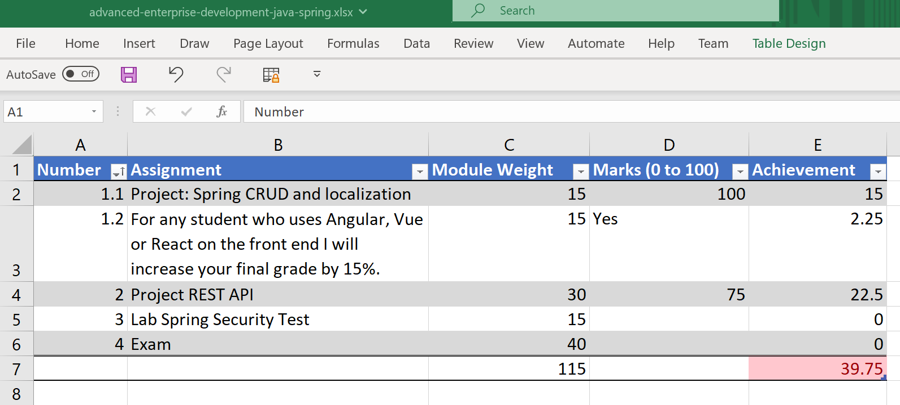

# [Grade Tracking](https://github.com/markcrowe-com/grade-tracking)

Some excel workbooks to help you track your progress with a course / module / semester. All workbooks are in the [Microsoft Office Excel](https://www.microsoft.com/microsoft-365/) format. The worksheets are locked. The `Protect Sheet` password is blank. To unlock the worksheets hit the `Review` tab and click `Protect Sheet` and hit then `Enter` key.

> Sample screen shot of [advanced-enterprise-development-java-spring.xlsx](./modules/advanced-enterprise-development-java-spring.xlsx)

## Courses/Semesters

- Data Analytics - Semester 1: [data-analytics-semester-1.xlsx](./courses/data-analytics-semester-1.xlsx)

## Modules

- Applications Programming: [applications-programming.xlsx](./modules/applications-programming.xlsx)
- Advanced Enterprise Development: [advanced-enterprise-development-java-spring](./modules/advanced-enterprise-development-java-spring.xlsx)
- Enterprise Application Development: [enterprise-application-development-jsp](./modules/enterprise-application-development-jsp.xlsx)

## Recommended Editors

- [Microsoft Office Excel](https://www.microsoft.com/microsoft-365/)
- [Microsoft Office Excel Online at Microsoft 365](https://www.office.com/launch/excel)
- [VS Code](https://code.visualstudio.com/) with the extension [`Office Viewer`](https://marketplace.visualstudio.com/items?itemName=cweijan.vscode-office). [^vs-code]

## Tools and Resources used

The following resources were used to develop the this repository:

### IDEs

- [VS Code](https://code.visualstudio.com/) - Code editing.Redefined. Free. Built on open source. Runs everywhere.[^vs-code]

[^vs-code]: The Extensions recommended for this repository and project are in [extensions.json](./.vscode/extensions.json)

### Source Code Management

- [Git](https://git-scm.com/) is a free and open source distributed version control system designed to handle everything from small to very large projects with speed and efficiency.
- [GitHub Desktop](https://desktop.github.com/) - Simple collaboration from your desktop
- [WinMerge](https://winmerge.org/) is an Open Source differencing and merging tool for Windows.

### Online Tools

- [GitHub](https://www.github.com) is a web-based hosting service for version control using Git. It is mostly used for computer code. It offers all of the distributed version control and source code management (SCM) functionality of Git as well as adding its own features.
- [gitignore.io](https://www.toptal.com/developers/gitignore) - Create useful .gitignore files for your project

---
Copyright (c) 2021 Mark Crowe <https://github.com/markcrowe-com>. All rights reserved.
